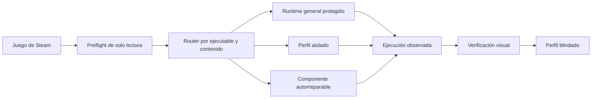

<p align="center">
  
</p>

<h1 align="center">Regression</h1>

<p align="center">
  <strong>Juegos de Windows en macOS, con perfiles aislados, reparación automática y evidencia real.</strong>
</p>

<p align="center">
  <a href="https://github.com/SwonDev/regression/releases/latest">
    
  </a>
  
  
  <a href="LICENSE">
    
  </a>
</p>

<p align="center">
  <a href="https://github.com/SwonDev/regression/releases/latest"><strong>Descargar</strong></a>
  ·
  <a href="#compatibilidad-certificada"><strong>Compatibilidad</strong></a>
  ·
  <a href="docs/README.md"><strong>Documentación</strong></a>
  ·
  <a href="#desarrollo"><strong>Desarrollo</strong></a>
</p>

---

Regression es una aplicación nativa de barra de menús que ejecuta Steam para Windows mediante
su propio motor de compatibilidad. Detecta el juego, prepara únicamente lo que necesita y mantiene
cada corrección aislada para no alterar los títulos que ya funcionan.

Regression es el único motor operativo. Su botella contiene la única carpeta física de juegos:
no comparte `steamapps`, credenciales, registro ni configuración con CrossOver, y no requiere
comprar, instalar o configurar otro producto de compatibilidad. Si detecta una biblioteca heredada,
la traslada dentro de la botella propia mediante renombres atómicos, sin copiar los juegos, y
mantiene rollback hasta que Steam y un juego se validan de forma explícita.

> [!IMPORTANT]
> Regression está en desarrollo activo y es un proyecto personal y educativo. La compatibilidad
> se certifica juego a juego mediante render, entrada, opciones y gameplay reales; un proceso que
> termina correctamente no se marca como compatible por sí solo.

> [!NOTE]
> El contrato del código fuente de esta rama es **Regression 1.12.14 (52)** y SQLite **v17**.
> **v1.12.14 (52)** repara la 1.12.13, que no podía arrancar Steam: **«La ruta gráfica no es elegible: `renderer.incomplete.dxmt:dxmt.d3d11+dxmt.d3d11`»**. El hash del `d3d11.dll` de DXMT vive en dos sitios y sólo se reselló uno. Los verificadores de shell comparan el archivo instalado, pero la app consulta su propio catálogo compilado —`RuntimeModuleCatalog.expectedSHA256`— **antes** de arrancar Steam, y ahí seguía el módulo anterior a la corrección de texturas staging, así que la app rechazaba su propio runtime aunque todos los verificadores pasaran. Ahora ambos declaran lo mismo y un contrato nuevo, `Tests/Shell/runtime-module-pin-coherence.sh`, falla si vuelven a separarse. Conserva de **v1.12.13 (51)**, que corrige la causa raíz que 1.12.12 había rodeado con un perfil: **DXMT no implementaba `UpdateSubresource` sobre una textura `D3D11_USAGE_STAGING`** y, en vez de degradar, **abortaba el proceso**. Es la ruta que usa la creación asíncrona de texturas de Unreal Engine 4, así que cualquier juego de ese motor podía cerrarse antes del primer fotograma —con el audio ya sonando— y sólo se descubría cuando alguien lo reportaba. Ahora la actualización se copia buffer a buffer por el command buffer, fila a fila, respetando el `bytesPerRow` del recurso y el direccionamiento por bloques de los formatos comprimidos; no es un `memcpy` desde CPU, que se saltaría el orden de las operaciones ya encoladas. El parche vive en `patches/dxmt-v0.72-update-staging-texture.patch` y `build/apply-dxmt-patches.sh` lo aplica en orden sobre el tag v0.72 del repositorio oficial, con el cross-process delante. El perfil de PixARK se conserva: está validado de punta a punta, y el arreglo del traductor cubre a los juegos que aún no conocemos. Conserva de **v1.12.12 (50)**, que blinda **PixARK**, que sonaba y se cerraba solo sin llegar a abrir ventana. No se caía el juego: lo abortaba DXMT. La creación asíncrona de texturas de Unreal Engine 4 hace `UpdateSubresource` sobre una textura `D3D11_USAGE_STAGING` y ese caso está sin implementar en el traductor, así que el proceso moría con `SIGABRT` durante la inicialización del RHI —con el audio ya en marcha, de ahí el fragmento de música—. Se midieron los tres caminos antes de elegir, porque los tres fallan y por motivos distintos: DXVK acepta el staging pero MoltenVK no compila sus *geometry shaders* y la GPU acaba perdida; Apple GPTK 4.0b2 se cuelga sin abrir ventana; Apple GPTK 3.0 lo ejecuta entero. `PixARK.exe` se enruta a esa generación por su basename exacto, con el mismo contrato indexado y fail-closed que ya usaban Grim Dawn, DragonSword, Dragon's Dogma 2 y FINAL FANTASY TACTICS. DXMT, su PIN y el baseline quedan intactos: la tienda de Steam y todos los demás juegos siguen exactamente donde estaban. Conserva de **v1.12.11 (49)**, que enseña los tres contadores de violaciones de evidencia que el informe de base calculaba y se guardaba: una certificación invalidada en silencio no aparecía por ninguna parte. Conserva de **v1.12.10 (48)**, que completa la autorreparación: el filtro exigía que el log nombrase el ejecutable del juego, y el log de un lanzador nombra el suyo, así que esa familia —TMNT— quedaba fuera y había que blindarla a mano; la exigencia se acota ahora a `drive_c/users`, que comparten todos los juegos, porque dentro de la carpeta del juego la ubicación ya lo asocia. Conserva de **v1.12.9 (47)**, que amplía la autorreparación: `CompiledCrashRepairLearner` sólo barría `drive_c/users`, así que un juego que escribe su traza junto a su instalación quedaba fuera del aprendizaje y había que blindarlo a mano; ahora también lee la carpeta del propio juego, derivada de la ruta Windows de su ejecutable y sin poder salirse de la botella. Conserva de **v1.12.8 (46)**, que corrige tres fallos vistos en uso real: la verificación manual de un juego fallaba con «una verificación de UI/CLI exige exactamente un envelope de lanzamiento» y, al lanzar dentro de la transacción, tampoco guardaba el veredicto —por eso el juego seguía «Pendiente de verificación visual» después de marcarlo a mano—; los runs que observa la telemetría, los del usuario abriendo el juego desde el propio Steam de la botella, no tienen envelope ni lo tendrán, porque ahí Regression no autoriza el lanzamiento. El envelope acredita la autorización, no la evidencia del veredicto, que sigue exigiendo la custodia completa de procesos. Además, el aviso «La evaluación se descartó porque Steam se está iniciando» dejaba de caducar y seguía en pantalla horas después de cerrar Steam. Conserva todo lo de **v1.12.7 (45)**, que arregla que un juego recién lanzado **no recibiera teclado ni ratón**: macOS 14 dejó de permitir que una aplicación se ponga al frente por su cuenta y Regression no participaba en el protocolo con el que Wine se cede la activación entre sus procesos; ahora lo hace, y `winemac.drv` concede el foco a la ventana que acaba de entrar en pantalla. Sonic Adventure 2 deja de renderizar negro con la música sonando —el `d3d9` de DXVK aliasa el sampler de sombra y Metal lo rechaza, así que ese proceso va al `d3d9` builtin de Wine—, The Witcher 3 arranca por primera vez —su prelanzador es de 32 bits y ahí no hay Vulkan, su interfaz Chromium se omite con el `--launcher-skip` del propio juego y su binario D3D12 va por D3DMetal— y ningún proceso de 32 bits vuelve a cargar DXVK. Conserva de **v1.12.6 (44)** el enrutado a D3DMetal por la evidencia que de verdad usa Unreal —el ejecutable declara `d3d12.dll` como *delay-load*—, en vez de exigir el Agility SDK junto a un `*-Win64-Shipping.exe`. Eso resuelve el «DX12 is not supported in your system» que se repetía juego tras juego: Redfall pasa de no arrancar a su pantalla de título con la escena completa, y Wayfinder inicializa D3D12. Conserva de **v1.12.5 (43)** el aislamiento del overlay de Epic Online Services dentro del proceso exacto de Cloudheim dentro del proceso exacto de Cloudheim, que moría con violación de acceso cuando ese overlay y el de Steam encadenaban hooks sobre el `d3d11` de DXMT, y enruta Dragonkin: The Banished a D3DMetal (Apple GPTK 4.0b2), que sin ruta caía al `d3d12` de Wine sobre MoltenVK y perdía toda la geometría estática del entorno. Conserva de **v1.12.4 (42)** el contexto OpenGL core forward-compatible para toda la familia SDL2/bgfx/HashLink y blinda Cursemark sin perfil por ejecutable; conserva las correcciones de instalación fresca, GPTK 3 y reinicio seguro de Steam, hace durable la custodia de la biblioteca frente a la renumeración de volúmenes tras reiniciar macOS y mantiene el shell `explorer.exe` de Wine como auxiliar sin icono en el Dock. **v1.11.0 (37)** permanece como baseline
> histórico verificable y como origen autorizado de la migración. La instalación de arriba
> siempre descarga la última release publicada.

## Instalación

```bash
curl --proto '=https' --tlsv1.2 -fsSL \
  https://github.com/SwonDev/regression/releases/latest/download/install_regression.sh | bash
```

El instalador es auditable, transaccional y conserva rollback. Antes de sustituir una instalación
comprueba la firma, el SHA-256 y el contenido del runtime descargado.

Después de la primera instalación, Regression detecta nuevas releases estables al arrancar y cada
seis horas. La actualización automática está activada por defecto: espera a que Steam de Regression
quede en reposo, descarga y verifica el instalador oficial, conserva botella y perfiles, reemplaza
la app de forma transaccional y la reinicia. Todo el flujo se controla desde **Mantenimiento**;
no hace falta volver a GitHub. [Detalles y garantías](docs/automatic-updates.md).

**Requisitos**

- Mac con Apple Silicon.
- macOS 14 o posterior.
- Rosetta 2; el instalador la prepara si falta.
- Cuenta gratuita de Apple Developer solo para los perfiles que necesiten GPTK/D3DMetal.

Los juegos que usan DXMT, DXVK u OpenGL no necesitan Apple GPTK. Cuando un perfil sí requiere
D3DMetal, Regression identifica también su generación exacta. Para GPTK 4.0b2 abre exclusivamente
la descarga oficial de Apple; después verifica el DMG, muestra la licencia completa y solo instala
tras una aceptación explícita. Los perfiles históricos fijados a GPTK 3.0 nunca se sustituyen por
4.0b2: si falta una fuente y autorización demostrables, el juego queda bloqueado con una explicación
en vez de arrancar sobre un backend incorrecto. El DMG autorizado queda en una caché privada para
futuras reparaciones; Regression nunca toma binarios de CrossOver, Whisky, Mythic o Homebrew.
[Flujo completo](docs/apple-gptk-onboarding.md).

<details>
<summary><strong>Qué prepara automáticamente</strong></summary>

| Capa | Comportamiento |
|---|---|
| Runtime | Wine, DXMT, DXVK, MoltenVK, VC++/UCRT x86 y x64 |
| Steam | Instalación oficial de Valve y botella propia recuperable |
| Medios | Windows Media WMA/WMV/ASF cuando el contenido del juego lo exige |
| Entrada | SDL y Switch2Bridge para mandos compatibles |
| Fuentes | Source Han Sans y recursos redistribuibles permitidos |
| Apple GPTK | Asistente nativo, licencia explícita y reparación desde el DMG oficial ya autorizado; nunca se redistribuye |

Modos disponibles: `--check`, `--verify-release`, `--yes`, `--launch` y `--help`.

</details>

La preparación automática no significa «instalar todo por si acaso». Windows Media, por ejemplo,
solo puede repararse para un App ID canónico cuya instalación acaba de inventariarse y contiene
WMA, WMV o ASF. La reparación exige Steam en reposo, payload sellado, lease exclusivo, backup,
recibo y verificación posterior; una sesión general de Steam no activa esa mutación.

## Diseñado para reparar sin romper

<table>
  <tr>
    <td width="33%" valign="top">
      <h3>🧭 Autodetección</h3>
      Identifica ejecutable, motor, contenido multimedia y requisitos antes de lanzar.
    </td>
    <td width="33%" valign="top">
      <h3>🛠️ Autorreparación</h3>
      Verifica manifiestos y reconstruye componentes permitidos de forma transaccional.
    </td>
    <td width="33%" valign="top">
      <h3>🧩 Aislamiento</h3>
      Las recetas se activan por juego y proceso. No se convierten en variables globales.
    </td>
  </tr>
  <tr>
    <td width="33%" valign="top">
      <h3>✅ Evidencia real</h3>
      Render, entrada, opciones y gameplay deben confirmarse visualmente.
    </td>
    <td width="33%" valign="top">
      <h3>↩️ Rollback</h3>
      Los cambios protegidos generan backup y se revierten si falla una puerta.
    </td>
    <td width="33%" valign="top">
      <h3>🔒 Privacidad local</h3>
      Perfiles, logs saneados y verificaciones permanecen en el Mac del usuario.
    </td>
  </tr>
</table>

## Una utilidad nativa de macOS

<p align="center">
  <picture>
    <source media="(prefers-color-scheme: dark)" srcset="assets/menubar/previews/all-states-dark.png">
    <source media="(prefers-color-scheme: light)" srcset="assets/menubar/previews/all-states-light.png">
    
  </picture>
</p>

Regression vive en la barra de menús, no en el Dock. La R comunica cuatro estados legibles:
preparado, trabajando, Steam activo y error. El popover reúne motor, biblioteca, juegos,
certificaciones, aprendizaje local y mantenimiento sin convertir la experiencia en un gestor
de botellas.

## Compatibilidad certificada

La siguiente lista procede del catálogo local versionado y de ejecuciones perfectas confirmadas.
Los expedientes públicos explican causa, receta, evidencia y regla de no regresión.

| Juego | Estado | Expediente |
|---|---|---|
| Cube World | Verificado perfecto | Catálogo integrado |
| FINAL FANTASY TACTICS — The Ivalice Chronicles | Verificado perfecto | Catálogo integrado |
| Grim Dawn | Verificado perfecto | [Ver expediente](docs/games/grim-dawn.md) |
| Clair Obscur: Expedition 33 | Verificado perfecto | [Ver expediente](docs/games/clair-obscur-expedition-33.md) |
| DragonSword: Awakening | Verificado perfecto | [Ver expediente](docs/games/dragonsword-awakening.md) |
| Hell Clock | Verificado perfecto | [Ver expediente](docs/games/hell-clock.md) |
| Heroes of Hammerwatch II | Verificado perfecto | [Ver expediente](docs/games/heroes-of-hammerwatch-2.md) |
| Secrets of Grindea | Verificado perfecto | [Ver expediente](docs/games/secrets-of-grindea.md) |
| Fields of Mistria | Verificado perfecto | [Ver expediente](docs/games/fields-of-mistria.md) |
| Titan Quest II | Verificado perfecto | [Ver expediente](docs/games/titan-quest-2.md) |
| Forsaken Isle | Verificado perfecto | [Ver expediente](docs/games/forsaken-isle.md) |
| RuneScape: Dragonwilds | Verificado perfecto | [Ver expediente](docs/games/dragonwilds.md) |
| Tinkerlands | Verificado perfecto | [Ver expediente](docs/games/tinkerlands.md) |
| Moonlighter 2: The Endless Vault | Verificado perfecto | [Ver expediente](docs/games/moonlighter-2.md) |
| Cross Blitz | Verificado perfecto | [Ver expediente](docs/games/cross-blitz.md) |
| Luminary Demo | Verificado perfecto | [Ver expediente](docs/games/luminary-demo.md) |
| Borderlands® 4 | Verificado perfecto | [Ver expediente](docs/games/borderlands-4.md) |
| Cursemark | Verificado perfecto | [Ver expediente](docs/games/cursemark.md) |
| Sephiria | Verificado perfecto | Validación directa del usuario |
| Dwarven Realms | Verificado perfecto | Validación directa del usuario |
| Monsuta | Verificado perfecto | Validación directa del usuario |
| Luma Island | Verificado perfecto | Validación directa del usuario |
| Crashlands 2 | Verificado perfecto | Validación directa del usuario |
| Tainted Grail: The Fall of Avalon | Verificado perfecto | Validación directa del usuario |
| IRON NEST: Heavy Turret Simulator Demo | Verificado perfecto | Validación directa del usuario |
| Granblue Fantasy: Relink | Verificado perfecto | Validación directa del usuario |
| Temtem: Swarm | Verificado perfecto | Validación directa del usuario |

También forman parte de la matriz de regresión Steam/CEF, Palworld y la ruta D3D9. Moonlighter 2
es a la vez un juego certificado y el control Unity obligatorio para cambios comunes de Wine.

**Reparados y pendientes de certificar**

- [Cloudheim](docs/games/cloudheim.md): overlay de Epic aislado dentro del proceso Shipping.
- [Dragonkin: The Banished](docs/games/dragonkin-the-banished.md): D3D12 enrutado a D3DMetal.
- [PixARK](docs/games/pixark.md): abortado por DXMT en una textura staging; va por Apple GPTK 3.0.
- [TMNT: Shredder's Revenge](docs/games/tmnt-shredders-revenge.md): la misma colisión de overlays
  en un juego **FNA**, que demuestra que el problema es del EOS SDK y no del motor.

**Validados con incidencia conocida**

- [Dragon's Dogma 2](docs/games/dragons-dogma-2.md): letterbox 16:9 compartido por la referencia.
- [Rotwood](docs/games/rotwood.md): superficie 1512×870 dentro de la pantalla disponible.

**Investigación abierta**

- [FANTASY LIFE i](docs/games/fantasy-life-i.md): bloqueado por la política oficial de EAC en
  entornos virtualizados; no se elude ni se presenta como compatible.

## Cómo funciona



El runtime general permanece fijado. Una corrección solo se promociona cuando supera la matriz
del juego objetivo, Steam y los perfiles afectados. Las recetas se compilan y versionan; la base
de aprendizaje nunca ejecuta comandos almacenados.

La telemetría agrupa launcher y ejecutable principal en una sola sesión. Una certificación
perfecta exige que el proceso representativo sea el PID exacto del run, que todos los procesos
rastreados hayan terminado y que la verificación sea posterior al cierre. Una rotación, truncado
o lectura incompleta del log se conserva como diagnóstico tipado; nunca se interpreta como un
lanzamiento limpio ni como compatibilidad.

## Componentes

| Área | Implementación |
|---|---|
| Aplicación | Swift 6, SwiftUI, Observation y AppKit donde macOS lo requiere |
| Compatibilidad | Wine x86-64 sobre Rosetta 2 |
| D3D11 | DXMT v0.72 con parche cross-process protegido |
| D3D9 | DXVK 1.10.3 |
| D3D12 | Perfil D3DMetal autorizado por juego cuando corresponde |
| Presentación | winemac, MoltenVK y perfiles OpenGL aislados |
| Datos | SQLite local con huellas de configuración, motor y evidencia |
| Distribución | Runtime recompilado para la ruta pública y asset verificado tras extraer |

El runtime público 1.12 se considera listo solo si supera como conjunto el wrapper `bin/wine`,
`bin/wineserver`, el loader Unix, `ntdll.so`, `wine.inf`, las dos mitades PE de `ntdll.dll` y
VC++/UCRT x86+x64 con hashes y permisos compilados. El launcher usa rutas absolutas al Wine y al
`WINESERVER` del runtime sellado, restablece `PATH` exactamente a
`/usr/bin:/bin:/usr/sbin:/sbin` y elimina cualquier `WINESERVERSOCKET` heredado. Así conserva las
utilidades canónicas de macOS sin aceptar un Wine, wineserver o `PATH` hostil del entorno. Un
runtime de desarrollo sin PIN reproducible queda deliberadamente no autorizado.

SQLite v17 conserva el sobre durable por App ID y endurece su recuperación. Vincula el run, el
preflight reciente, la generación de requisitos y las identidades cerradas de componentes y
perfiles, pero no almacena comandos, rutas ni DLL arbitrarias. La creación del sobre, el `spawn`,
la adopción de su run por la telemetría, el paso a espera de verificación y el cierre mediante una
verificación explícita sí están integrados.

v17 también define y prueba una política pura que solo consideraría un reintento para una receta y
versión compiladas, nacidas en Regression, y que distingue cuándo correspondería rollback o solo
reconciliación. Esa política no ejecuta acciones: el auto-retry y el rollback automáticos permanecen
bloqueados hasta que exista un ejecutor conectado que verifique la receta compilada, aplique su
rollback y persista el recibo. Un lanzamiento observado desde Steam o un intento agotado continúa
requiriendo un gesto explícito, y ningún recibo se convierte en certificación.

## Documentación

| Quiero… | Documento |
|---|---|
| Entender el proyecto | [Índice de documentación](docs/README.md) |
| Conocer el protocolo de compatibilidad | [Investigación reproducible](docs/compatibility-research.md) |
| Revisar arquitectura, datos y privacidad | [Plataforma de compatibilidad](docs/compatibility-platform.md) |
| Entender autorreparación y evolución de runtimes | [Evolución tecnológica](docs/runtime-evolution.md) |
| Preparar una prueba segura | [Preflight y evidencia](docs/game-test-readiness.md) |
| Revisar la app nativa | [Auditoría nativa](docs/native-app-audit.md) |
| Consultar un juego | [Expedientes de juegos](docs/README.md#expedientes-de-juegos) |

Las reglas operativas para agentes y mantenedores viven en [`AGENTS.md`](AGENTS.md). El contrato
visual está en [`DESIGN.md`](DESIGN.md).

## Desarrollo

Este checkout corresponde a la release **1.12.14 (52)**. Los helpers que nombran `public-1.11`
son puertas históricas para comprobar la transición desde el asset anterior; no definen la
versión estable actual.

```bash
# Validación Swift
swift test
swift build -c release

# Estado protegido y botella
bash build/verify-protected-state.sh --include-bottle

# Preparar el staging firmado de la release; no se ejecuta desde el checkout
bash Scripts/package_regression.sh
codesign --verify --deep --strict Regression.app

# Verificación del asset que recibiría un Mac limpio
bash build/verify-release-asset.sh ASSET CHECKSUM VERSION BUILD
```

El verificador extrae el mismo tar que recibirá el usuario, audita dependencias, firmas,
redistribuibles y rutas, y ejecuta además un arranque mínimo de Wine. Un asset cuyo wrapper no
pueda localizar y cargar su `ntdll.so` se rechaza antes de poder publicarse o instalarse.

`Regression.app/` es un staging local de empaquetado, no un bundle ejecutable desde el checkout,
y no debe registrarse ni abrirse. La única app canónica es el bundle físico
`/Applications/Regression.app`; su Wine se recompila para
`/Applications/Regression.app/Contents/SharedSupport/wine-root`. Mover el bundle sin recompilar
rompe sus rutas horneadas. Antes de entregar una build, ejecuta
`bash build/verify-canonical-installation.sh` para comprobar firma, Spotlight y LaunchServices.

## Licencia y límites

El código propio se distribuye bajo [LGPL-2.1 o posterior](LICENSE). Las atribuciones y límites
de redistribución están documentados en [NOTICE.md](NOTICE.md).

- No se publican credenciales, botellas, saves ni datos locales.
- No se copian binarios propietarios de productos de comparación.
- GPTK/D3DMetal pertenece a Apple y solo se usa desde una instalación autorizada del usuario.
- Regression no está afiliado con Valve, Apple, CodeWeavers ni los estudios de los juegos.

---

<p align="center">
  
  <br>
  <strong>Regression</strong><br>
  <sub>Compatibilidad medible. Reparaciones aisladas. Cero certificaciones por intuición.</sub>
</p>
